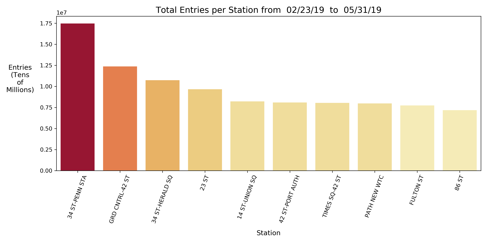
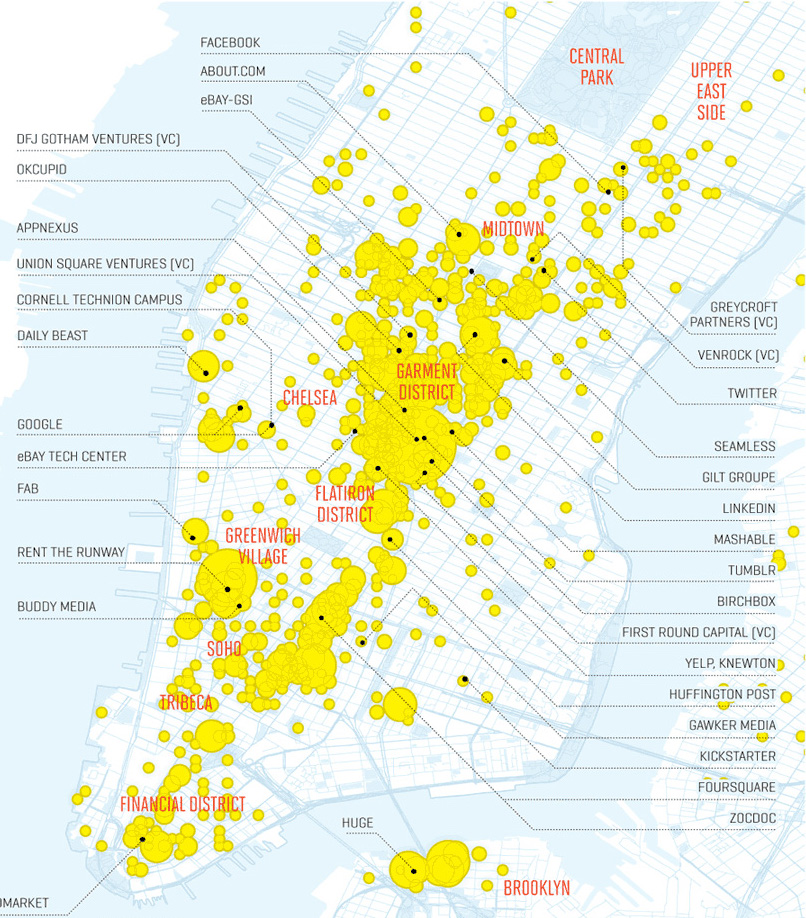

Hi! This is the inaugural post on my blog, which will serve as a record of my recent Data Science projects and explorations. Many of the posts, including this one, will feature projects completed for the Metis Data Science Bootcamp.

I'm going to share my most recent project, based on the following hypothetical scenario: an organization has come to me asking for an analysis of where to most effectively place a team of people to hand out flyers for an event on **women in tech** in NYC. This organization has reasoned that the most effective way to reach a large audience would be to place people at various subway stations.

The goal of this project is to provide a list of NYC transit stations to target for handing out flyers. The station's total volume of people and proximity to tech businesses will guide this decision.

## Data Cleaning
We analyzed data from March through May, 2019, and considered the counts of turnstile entries but didn't consider turnstile exits. Entry data tend to be more accurate because New Yorkers don't always use the turnstile when exiting.

The data for each turnstile is provided as a running sum. So to get the total number of people entering a turnstile on a given day, we took the difference between the maximum and minimum number of entries for that day. But not all of these values are correct. The raw entry values are running sums which reset when they max out, so for days when a turnstile count resets, the maximum is huge while the minimum is tiny, resulting in a difference that is huge and inaccurate. To deal with this, we simply dropped any total entry values greater than 1,000,000, an unrealistically high number for any day. It's acceptable to drop these data points from our analysis because we are looking to get a ranking of highest traffic stations, not an accurate count of riders per station.

## Analysis
We sum all of the turnstile entries per day for each station to rank them.

A team member handing out flyers at 34th Street Penn Station could ambush many people, but are the people at that station the *most* likely to attend a women in tech event? Maybe not. People who work in tech are far more likely to attend, and we can easily target this demographic by choosing stations close to tech hubs.

To get our final recommendation of stations to target, we worked our way down the list of stations with the most traffic and only included stations close to tech hubs.

## Recommendation of Stations to Target
* 34th Street - Penn Station
* Grand Central - 42nd Street
* 34th Street - Herald Square
* 23rd Street Subway Station
* Fulton Street Station

---

## Technical Note
Data cleaning and analysis was done using python and Pandas.
