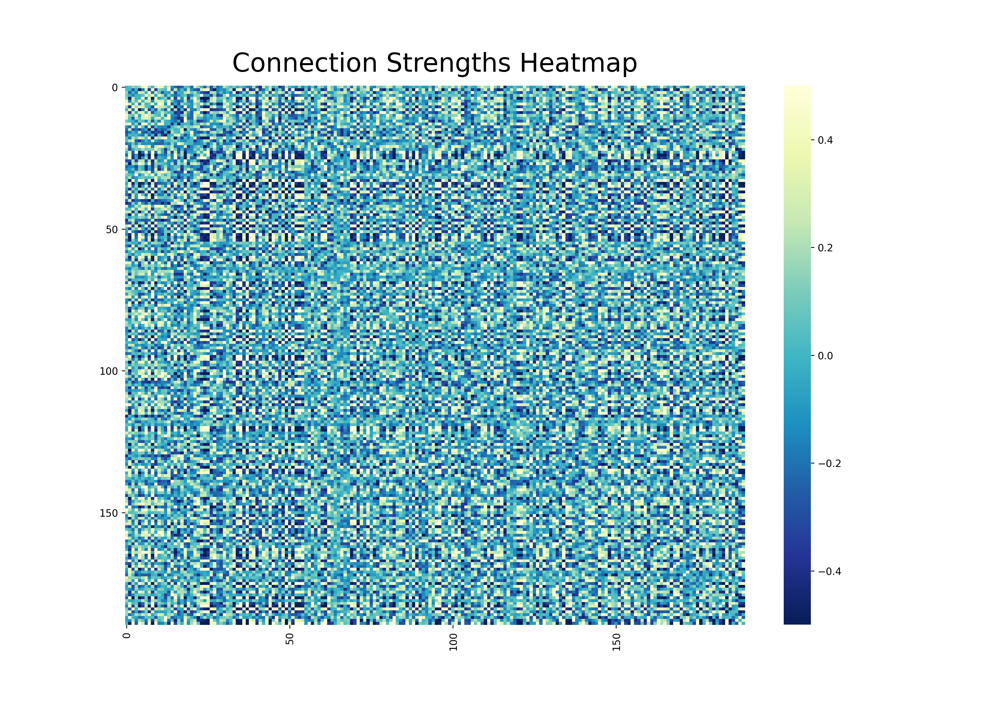
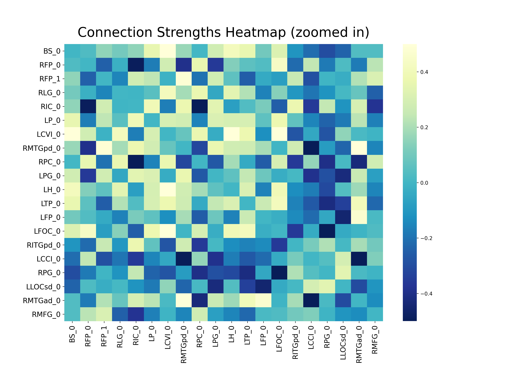
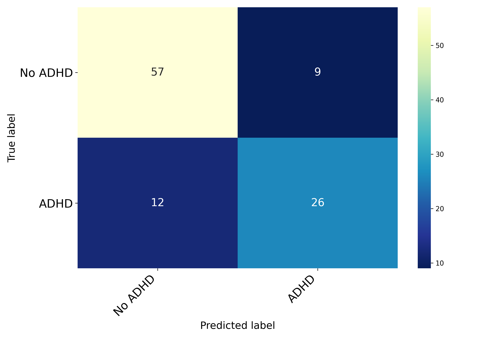
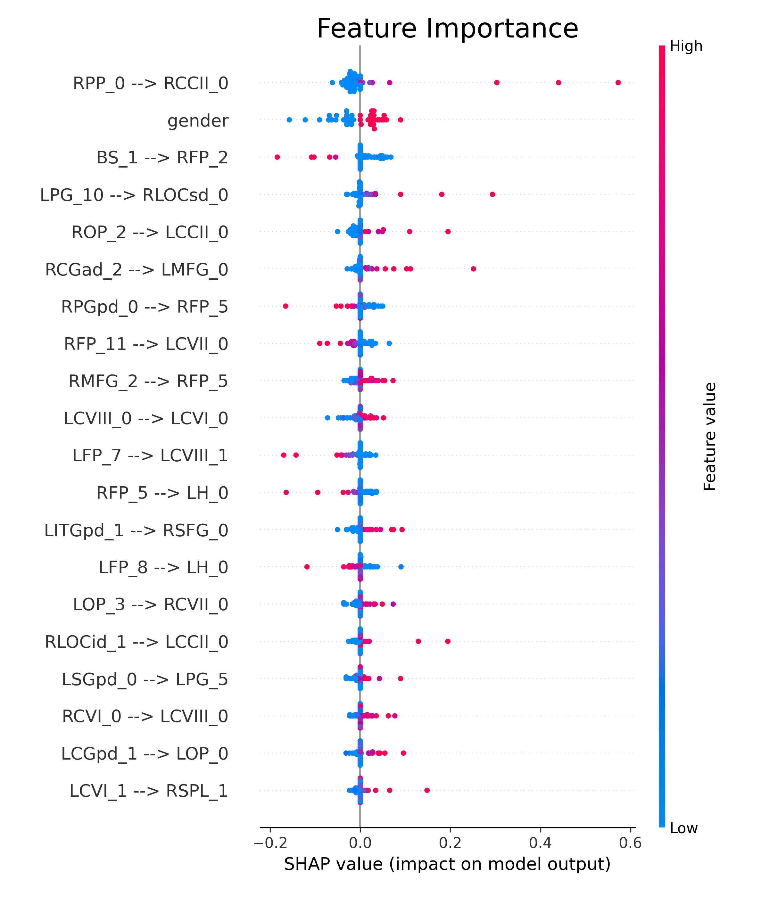

In this post I'll be exploring whether functional brain connectivity can predict ADHD diagnosis. Predicting ADHD based on physiology rather than behavior could provide doctors a more accurate tool for diagnosing ADHD. Additionally, we can learn about ADHD and the brain by seeing which brain connections are most predictive of the disease.

## What is functional brain connectivity and how is it measured?

The brain can be thought of as a network of connected systems, where information flows along connections between the different regions. *Functional brain connectivity* refers to a map of the connection strengths between all of the different regions. Connection strengths can be estimated by analyzing fMRI images to see which brain regions are active at the same time. Processing fMRI images to extract connection strengths is not easy to do, but luckily I found the [USC Multimodal Connectivity Database](http://umcd.humanconnectomeproject.org/), which provides preprocessed connection strength data.

The connection strength data comes in the form of a *connectivity matrix*, which is a matrix representation of functional connectivity. Each value in the matrix represents the connection strength between the two regions specified by the row index and column index. For those familiar with graph theory terminology, a functional connectivity matrix is an *adjacency matrix* with *weighted, undirected* edges. See [this page](www.scholarpedia.org/article/Brain_connectivity#Modes_of_Brain_Connectivity) for more on brain connectivity. 

#### Functional connectivity matrices

Below is the functional connectivity matrix for a single subject from the dataset.

<figure>
  
</figure>

The brain was divided into 190 distinct regions, so the matrix is size 190x190. That's pretty overwhelming, so let's take a closer look at just the top left corner.

<figure>
  
</figure>

The zoomed in matrix shows only the connection strengths for the first 20 regions. Stronger connections have a brighter, green/yellow color, and weaker connections have a darker, blue color. All of the connection strengths are encoded in the (full size) matrix.

Notice that this matrix (which I will call FC) is symmetric along an axis from the top left to the bottom right. To see why this happens, look at the value of FCRFP_0, RIC_0 (for a matrix M, the value at row *r*, column *c* is denoted Mr, c ), the first dark square in the second row. This same value appears in FCRIC_0, RFP_0 a little below and to the left. These two values encode the strength of the same connection: RFP_0 to RIC_0, and the reverse direction RIC_0 to RFP_0. Connection direction cannot be easily distinguished using fMRI, so each direction of the same connection is given the same strength.

I hope you now understand how a functional connectivity matrix like the one above captures useful measures of brain connectivity.

## Data

The dataset I worked with had functional connectivity matrices from 520 subjects, 190 of which had been diagnosed with ADHD.

The connection strengths in each subject's connectivity matrix were converted to binary values using a threshold of 0.2 such that any connection strength above 0.2 became a 1, and anything below 0.2 became a 0. This ensures that only the strong positive connections are used in the analysis.

Next, I decided which connections to use as features for modeling. If every connection was used there would be 18,050 features, too many for most models to handle. I retained only the features most correlated with having ADHD by calculating the pearson correlation p-value for each feature against the ADHD label vector. 291 connections had a correlation p-value less than 0.005.

##### Network statistics

Three local network statistics were calculated using each subject's connectivity matrix with the goal of capturing certain measures of how the brain regions are segregated, integrated, etc. The measures were the node degree (how connected a brain region is among all other regions), the node clustering coefficient (how segregated a region is among neighboring regions), and the node closeness (how integrated a region is among neighboring regions). Each subject then had 570 (3 node measures x 190 nodes) additional features useful for prediction.

Again, only the features that were most correlated with having ADHD were used for modeling. With a correlation p-value cutoff of 0.05, 50 of these features remained. I referenced [this paper](https://onlinelibrary.wiley.com/doi/pdf/10.1111/jcpp.12712) and [this paper](https://www.nature.com/articles/s41398-018-0213-8) when deciding which statistics to calculate.

## Modeling and Results

A [soft voting ensemble classifier](https://scikit-learn.org/stable/modules/generated/sklearn.ensemble.VotingClassifier.html) was trained to predict whether a subject had ADHD or not. Three models were ensembled: gaussian Naive Bayes, SVM with RBF kernel, and logistic regression.

The [**ROC AUC**](https://en.wikipedia.org/wiki/Receiver_operating_characteristic#Area_under_the_curve) score was maximized, with a final score of **0.774**. The ROC AUC score considers the precision and recall of the model, both of which are important in a situation such as diagnosing a neurological disorder: under-diagnosing ADHD means some subjects could go untreated, but over-diagnosing ADHD burdens the health care system (and the misdiagnosed patient).

The confusion matrix for the final predictions on the held-out data is below.

<figure>
  
</figure>

## Model interpretation

[SHAP](https://shap.readthedocs.io/en/latest/) was used for feature importance/model interpretation. The top 20 most important features can be seen below. Feature values (dots) to the right of the vertical gray line encouraged the model to predict the positive class, ADHD. Dots further from the vertical gray line had more of an effect on the model output. Each dot represents the importance of that feature for a single subject, so many subjects are needed to show the general trend for any feature. More on SHAP summary plots [here](https://christophm.github.io/interpretable-ml-book/shap.html#shap-summary-plot).

The plot is a bit confusing so I'll explain the first feature, 'RPP_0 --> RCCII_0', at the very top. The value of this connection strength was the most predictive feature out of every feature provided to the model. Large values of this connection strength (pink dots) were strongly predictive of having ADHD (positive impact on model output, because ADHD is the positive class, labeled as 1). However, small values of this connection strength (blue dots) had little effect on the model output.

<figure>
  
</figure>

Pink dots mean the connection was strong, and blue values mean the connection was weak. With this in mind, we can see that sometimes strong connections were predictive of having ADHD, while other times strong connections were predictive of *not* having ADHD. From this we can infer that ADHD is characterized by the upregulation of a specific set of connections as well as the downregulation of others. For example, this model indicates that **the connection between the *right planum polare* and the *right cerebellum crus II*** (RPP_0 --> RCCII_0) **is upregulated in those with ADHD**. Feature importance analysis could guide future research into the physiology of ADHD.